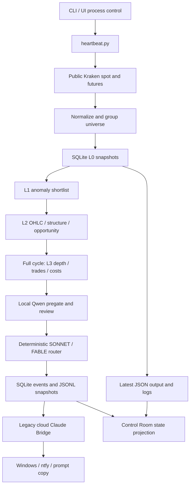
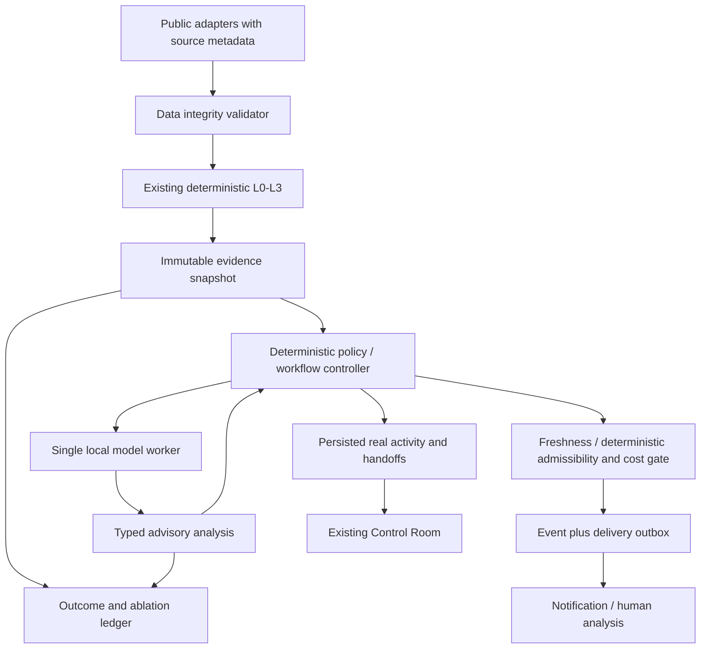

# Architecture

Audited 2026-09-14. Sections marked CURRENT describe code. TARGET sections are accepted design, not deployed functionality. `docs/TAKEOVER_AUDIT.md` records defects and evidence; `ROADMAP.md` controls implementation order.

## CURRENT: entry points and flow

`radar.py` is still the complete v0.7 implementation plus a handwritten `--mode` dispatcher. No mode defaults to v0.7. For v0.8, `radar_v08/cli.py` owns command dispatch and the synchronous loop. `ui/__main__.py` → `ui/app.py` launches PyWebView; `ui/process_manager.py` starts `radar.py --mode loop` using a real Python interpreter.

Heartbeat cycles already perform L2; only full cycles add L3/Qwen/routing. The loop drains the bridge after both cycle types. Default configured cadences are 60 seconds heartbeat and 300 seconds full; these are not guaranteed deadlines because work is synchronous and followed by sleep. A long inference can delay collection.

### Module map

| Area | Modules | Responsibility / limit |
|---|---|---|
| Wiring/config | `cli`, `config`, `heartbeat` | Environment constants, orchestration, output; heartbeat is a large procedure, not an agent framework |
| Transport/data | `http_client`, `security`, `kraken_spot`, `kraken_futures`, `normalize`, `universe` | Public endpoints, retries, parsing, aliases, selected markets; not a complete data-integrity service |
| L1 | `anomaly`, `store` | MAD-based anomalies and snapshot history; pair identity defect documented |
| L2 | `l2`, `l2_features`, `structure`, `setups`, `opportunity` | Incremental OHLC cache/cursor, ATR, structure/setup/score, forward labels |
| L3 | `l3`, `microstructure`, `tradeability` | Bounded finalists, spot/futures books, recent spot trades, liquidity and preliminary costs |
| Inference/policy | `qwen`, `router`, `cooldown`, `budgets` | Local Qwen, deterministic demand selection, counters; demand and actual-call accounting are currently coupled incorrectly |
| Events/analysis | `events`, `store`, `claude_bridge`, `analysis_schema`, `context_builder`, `prompts` | Queue lifecycle, persisted context, cloud analysis and retries |
| Delivery | `notifications`, `ntfy`, `alerts`, `prompt_builder`, `clipboard`, `prompt_popup`, `mock_alert` | Delivery and reconstruction; mock-alert is not side-effect-free |
| Outputs/compatibility | `output`, `logging_setup`, `terminal`, `shadow` | JSON/JSONL/text and legacy comparison; JSONL is not an authoritative transactional log |
| UI | `ui/bridge`, `data_reader`, `agents`, `process_manager`, `paths`, `ui_state`, `web/*` | Python API, state projection, process ownership, HTML/CSS/SVG renderer |

### Persistence and lifecycle

`SnapshotStore` opens SQLite with WAL, a connection lock, schema initialization and additive migrations. Data is mostly untyped dictionaries/SQLite rows and REAL numeric values. There is no migration-version ledger. Opening a UI store can perform schema work.

The actual inspected database has these 14 application tables (plus SQLite's internal sequence table):

| Tables | Use |
|---|---|
| `assets`, `spot_snapshots`, `futures_snapshots`, `radar_runs`, `alerts` | Universe/ingestion, historical features, runs and L1 detections |
| `ohlc_bars`, `ohlc_cursor`, `l2_feature_snapshots`, `forward_returns` | Incremental candles, L2 features and raw spot markouts |
| `events` | Candidate demand, context, lifecycle, attempts, notification state |
| `model_analyses`, `bridge_health` | Legacy model responses/call information and health |
| `model_budget_usage`, `model_cooldowns` | Per-role time-window counters and cooldown records |

Current statuses: `PENDING`, `PROCESSING`, `PROCESSED`, `DEFERRED`, `FAILED`. Conditional claiming is useful, but open-event deduplication and budget consumption are not transactionally safe across processes. Claim, inference, analysis persistence, notification, and JSONL writes span different transactions. Crash/retry may duplicate side effects; no exactly-once delivery guarantee exists. Recovery has a stale-processing cutoff, not evidence freshness or a fenced lease.

`events.jsonl` records snapshots of mutable event state. `radar_v08_output.json` is overwritten with the latest cycle; it is neither a live inference-progress signal nor historical evidence. Raw forward-return labels use 15m/1h/4h horizons; no 24h or net-cost agent ablation exists yet.

### Current agents and UI truth

Qwen is the only actual local LLM integration. Red Team is NOT_CONFIGURED. Sonnet/Fable registry entries are projections over the cloud bridge. “Orchestrator” in a UI label does not implement orchestration. `collect_real_agent_communications()` intentionally returns `[]`.

The room has a reusable SVG worker renderer, explicit topology, communication-ID deduplication, arrival reactions, and Node tests. Its source is a good base for richer spatial visualization. Current status inference is imperfect: queued legacy work may display PROCESSING; cached old output can still imply health; Qwen COMPLETED can describe a cycle with candidates but no successful review. New telemetry should correct those semantics without fabricating activity.

## TARGET: deterministic local analysis workflow

Keep these as small boundaries inside the existing package initially. New pure modules may depend on domain types and explicit clock/config inputs; transport/storage/UI are adapters. Introduce enforceable import constraints for new boundaries, not a mass directory move. No broker, distributed framework, vector database, or autonomous tool-using agent is required.

### Integrity and evidence

Validator output: version, instrument key, as-of time, per-check status (`PASS`, `FAIL`, `UNKNOWN`, `NOT_APPLICABLE`), reason codes, observed/source timestamps, coverage, and allowed analysis capabilities. Missing required evidence blocks the relevant analysis. Optional missing evidence permits only a declared degraded path. An arbitrary aggregate score never cancels a hard failure.

Identity includes venue, market kind, native instrument ID, base/quote, and contract/settlement identity where relevant. L1 history must use the selected pair; cross-market corroboration must be explicit and unit-normalized. Preserve raw exchange timestamps where supplied and separately store receive time. A receive timestamp is not proof of exchange freshness. Validate finite positive prices, crossed/empty books, nonnegative quantities, duplicates, candle alignment/closure, OHLC inequalities, gaps, recent-trade consistency, exchange status, mapping changes and clock skew. Listing/unlock/funding claims remain UNKNOWN without sourced metadata.

Evidence snapshot: `schema_version`, `run_id`, `opportunity_id`, immutable `evidence_version`, `instrument_id`, collection timestamps, `valid_until`, integrity report, feature/calculation versions, raw-observation references, units/provenance, and a content hash. Each observation/calculation receives a stable ID within that version. Derived facts record their dependencies. A new fetch or changed calculation makes a new version; never silently replace evidence under an active analysis.

Claims carry an ID, kind (`observation` or `inference`), text, and supporting evidence/premise IDs. Validate ID existence, instrument, run/version and permitted visibility. Existence checks alone do not establish that the citation supports the claim: evaluate support errors on a labeled sample. Reject unknown references; do not let an LLM mint trusted evidence. Dates/prices in factual claims must be traceable. General inference can identify premises without a fake market citation.

### Roles, independence, context

| Role | Input / output | Authority |
|---|---|---|
| Controller | Validated evidence, policy, worker results → next allowed state/action | Sole owner of budgets, deadlines, transition and publication |
| Screener | Compact L1–L3 evidence → reject/watch/escalate advisory result | No direct tools or dispatch; current Qwen is baseline |
| Red Team | Independent structured evidence, normally no prior confidence/thesis → counter-hypotheses, gaps, challenge result | No veto over deterministic facts; model-family diversity tested |
| Deep Analyst / Fable | Selected evidence plus explicitly permitted prior results → grounded synthesis and uncertainty | No sizing, leverage, account assertions, or execution rights |
| Optional bounded routing adviser | Controller-provided eligible path list and summaries → one enum recommendation | Cannot create nodes, extend budget, refresh deadlines, or call agents |

Run deterministic challenges first: spread/target feasibility, ATR/VWAP extension, BTC residual logic, depth, activity anomalies and known funding/data artifacts. Do not hire an LLM to recalculate arithmetic. Unsupported calculations (e.g. BTC beta with insufficient history) remain unknown.

Use a bounded per-run evidence view, not a shared evolving chat. Prior agent confidence is hidden by default from independent roles. Prior hypotheses may be shown only in a separately identified critique/synthesis stage. Memory initially means persisted factual run records and versioned summaries with explicit retrieval cutoff and size limit. Outcomes from the future or another ablation arm must not leak into a decision. No unrestricted persistent “agent memory.”

### Workflow, deadlines and resource controls

Planned analysis states: `CREATED → VALIDATING → READY → ANALYZING → FINALIZING → COMPLETED`, with explicit `REJECTED`, `INSUFFICIENT_DATA`, `ABORT_STALE`, `BUDGET_EXHAUSTED`, `FAILED`, and `CANCELLED` terminal outcomes. These require an additive, versioned workflow table; do not overload existing historical event statuses casually.

Every invocation has a stable request ID, evidence version, model profile/digest, prompt/schema version, start/end times, token/call reservation, retry count, deadline and result status. Reserve atomically with the claim; count attempts and results separately. Record failures and warm-up/load time. Use lease generation/fencing if recovery is supported: late output from an old lease cannot commit or notify.

Initial topology is acyclic and optional nodes execute at most once. One schema-repair attempt maximum must fit within the same declared budget and deadline. Cap total calls, input/output tokens, wall-clock time, node visits, and duplicate requests. Content hashes detect exact duplicates; do not introduce approximate semantic deduplication until its false-merging risk is measured. Opportunity identity must not collapse distinct evidence versions.

Set `valid_until` using data type, analysis horizon and measured latency policy, not a guessed universal timeout. Check it before each node, after inference, and before notification enqueue. Cancellation stops publication even if the inference worker cannot immediately interrupt computation. Never refresh a stale opportunity indefinitely: re-observation creates a new analysis version. UTC timestamps support audit; monotonic clocks enforce elapsed-time budgets. OC-1 in `docs/OPERATING_CONTRACTS.md` fixes initial timing, context, backpressure, drift and experimental promotion limits. Changes require versioned evidence, never an LLM choice.

Separate collection from expensive inference when introducing the worker so a model swap cannot halt freshness monitoring. Start with one inference slot on the verified 16 GB GPU. Profile cold/warm load and actual residency, context KV cache, swap time, token throughput, RAM pressure and p95 end-to-end latency. Do not batch stale opportunities merely to reduce swaps. The installed 18 GB coder model is not assumed fully GPU-resident or useful for market analysis.

### Cost, admissibility, portfolio

Adapt an itemized Cost Engine around the existing L3 measurements: entry/exit fees, explicit spread convention, side-specific book impact, order-size assumption, FX conversion and verified funding settlement coverage. Distinguish measured, assumed, unavailable and lower-bound costs. Specify whether book impact is relative to mid or touch so spread is not double-counted. A missing leg gives incomplete net cost, not zero.

Deterministic admissibility gates input validity, liquidity and cost feasibility. This is not a complete portfolio Risk Engine. Account/portfolio state is outside R0–R7 and fully specified for the separate F0–F7 program in docs/EXECUTION_ARCHITECTURE.md; no private data collection or sizing is needed to measure analysis quality. Future manual/synthetic account scenarios must be labeled and cannot authorize an order. See `RISK.md`.

### Communication, persistence and observability

Keep opportunity, invocation, lifecycle and actual handoff distinct. A persisted handoff carries `communication_id`, `run_id`, `opportunity_id`, source/destination role, invocation IDs, evidence version, sequence, timestamp, type and reason. Only a real controller dispatch/acceptance can emit it; merely choosing a possible route cannot. Store transition and outbox entry in one SQLite transaction. Project to the existing UI's `{id, from, to, ts, type, reason}` contract, with versioned metadata added compatibly.

Expose queued/loading/running/completed/error/stale separately. The room's receiving/waking pose is a short visual reaction to a real event; working requires a real invocation state. Polling with a cursor supports restart/reconnect without replaying old pulses as new work. Persist semantic events, not animation frames. Invalid telemetry has a rejection counter and never invents a replacement event.

Use correlation IDs across collection, integrity, evidence, policy, worker and notification. Record queue age, observation age, integrity reasons, calls/tokens, cold/warm load, total latency, timeouts/aborts, schema/citation errors, cost coverage and notification retry status. Treat remote notification as at-least-once unless the provider offers idempotency. Retention must preserve evidence through the 24h label horizon and reproducible experiment reporting; define pruning and archive policy before expanding ingestion.

### Outcome measurement

Extend existing pair-specific forward labels to 15m/1h/4h/24h outcomes linked to evidence, direction, venue, decision and ablation arm. Separate gross market markout from executable net scenario return. L3/screener-only paths must be measured even if not escalated or notified. Retain failures, invalid inputs and ABORT_STALE in coverage denominators. Missing quotes at a horizon yield a missing label, not a successful zero return.

Pre-register arm assignment, thresholds, primary horizon and practical minimum benefit before looking at outcomes. Report paired/blocked uncertainty intervals for correlated assets/time windows, cost sensitivity, sample counts and exclusions. Separate frozen-evidence reasoning comparisons from live delay-sensitive comparisons; charge actual inference delay in the latter. Promote complexity only if the pre-registered net-quality/coverage benefit survives uncertainty and the hardware/deadline budget. Insufficient evidence means keep the simpler pipeline.

## Authoritative detailed contracts and future end state

`docs/OPERATING_CONTRACTS.md` (OC-1) is the numeric scheduling/context/retention/model-evaluation/calibration/ablation authority. Its fixed procedures replace the earlier high-level descriptions wherever more specific. `docs/FAILURE_AND_QUALITY.md` defines new package boundaries, exceptional Python quality and failure ownership. `docs/EXECUTION_ARCHITECTURE.md` defines the future deterministic trade/risk/order/position design; `docs/FUTURE_TRADING_ROADMAP.md` defines permission and promotion gates. All are ACCEPTED DESIGN, not implemented.

Future chain: valid opportunity and typed advisory outputs → deterministic synthesis/Trade Decision Engine → fresh reconciled account + itemized costs → deterministic Risk Engine and reservations → bounded Order Planner → durable Execution Engine/private adapter → exchange acknowledgments/fills → reconciled ledger and deterministic Position Manager with native protection. Models have no order-tool access and no risk authority. First live scope, if ever authorized, is cash-funded spot LONG only. Short/derivative execution requires its own capability program. Analysis-only deployment never constructs a private submission adapter.

Finalization revalidation is a separate immutable receipt bound to the analysis version; it never edits facts underneath the completed reasoning. No model ordering/assignment is guessed: OC-1 defines the experiment, metrics, decision rule and disabled/default behavior. Future work executes these procedures rather than inventing missing architecture.
