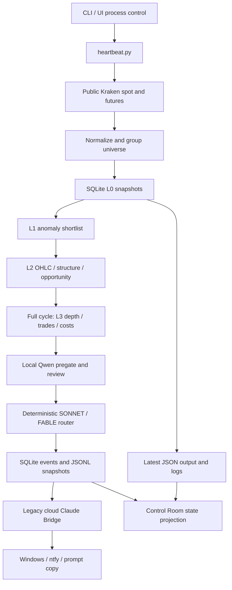
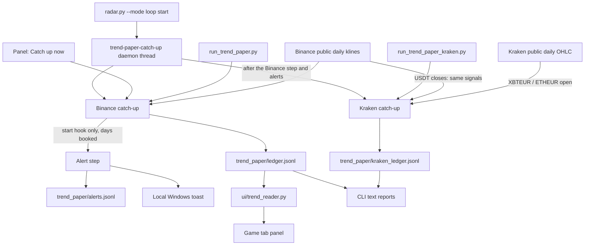
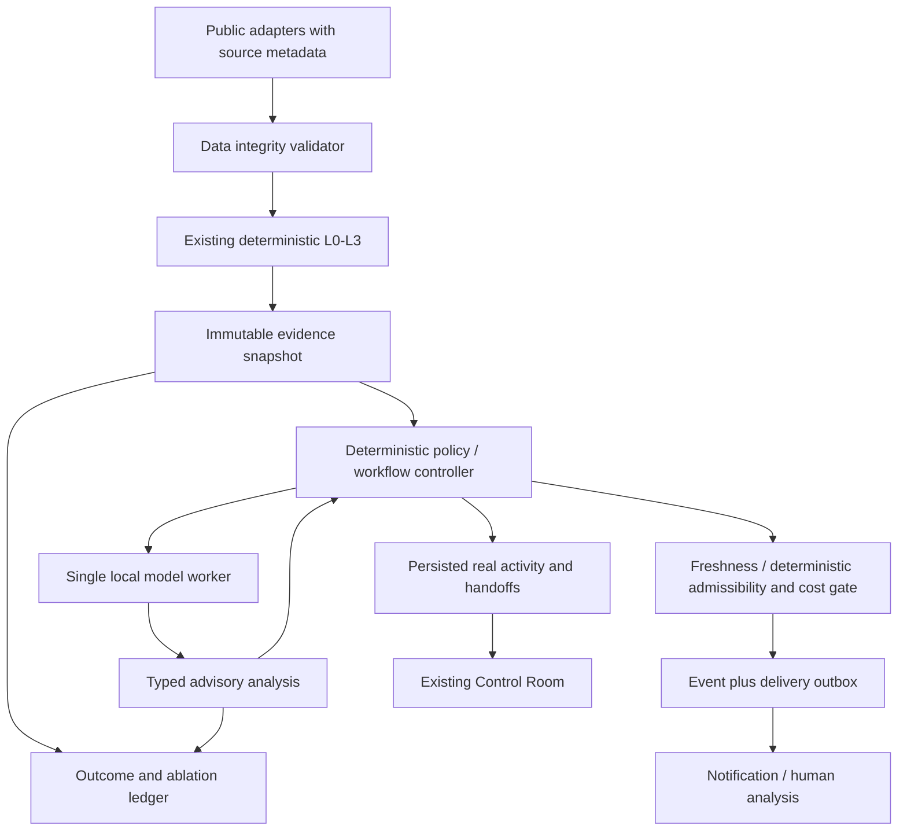

# Architecture

Current implementation correction (2026-09-30): statements below that no account model, risk engine, paper ledger or private adapter exists predate these additions. Now in code: the paper game with the EX-1 paper exit policy ([docs/EXECUTION_ARCHITECTURE.md](docs/EXECUTION_ARCHITECTURE.md)) and `radar_v08/paper_monitor.py`; the pure Risk Engine `radar_v08/domain/risk.py`, the append-only `pilot_*` tables and the pilot shadow service for a 240 EUR pretend account (mode **PAPER**, not SHADOW_LIVE); and `radar_v08/adapters/kraken_private_read.py`, which reads accounts only, refuses write endpoints and is imported by no radar, loop, paper, pilot or UI module (only by the separate command `scripts/kraken_account_check.py`). No live order path, Order Planner, Execution Engine or reconciliation exists, and no strategy has qualified. The F0-F7 gates and all permission boundaries are unchanged. See [Paper wallet reporting](#current-paper-wallet-reporting-2026-09-30) for the wallet valuation.

Current implementation addition (2026-10-04): the research-only trend paper module keeps paper books from public Binance and Kraken daily candles in its own ledgers under the state dir, with a start hook, local alerts, CLIs and a read-only Game tab panel. It adds no order path, account access or qualification. See [Trend paper module](#current-trend-paper-module-research-paper-only-2026-10-04).

Audited 2026-09-14. Sections marked CURRENT describe code. TARGET sections are accepted design, not deployed functionality. `docs/TAKEOVER_AUDIT.md` records defects and evidence; `ROADMAP.md` controls implementation order.

## CURRENT: entry points and flow

`radar.py` is still the complete v0.7 implementation plus a handwritten `--mode` dispatcher. No mode defaults to v0.7. For v0.8, `radar_v08/cli.py` owns command dispatch and the synchronous loop. `ui/__main__.py` → `ui/app.py` launches PyWebView; `ui/process_manager.py` starts `radar.py --mode loop` using a real Python interpreter.

```mermaid
flowchart TD
  CLI[CLI / UI process control] --> HB[heartbeat.py]
  HB --> K[Public Kraken spot and futures]
  K --> U[Normalize and group universe]
  U --> S[SQLite L0 snapshots]
  S --> L1[L1 anomaly shortlist]
  L1 --> L2[L2 OHLC / structure / opportunity]
  L2 --> L3[Full cycle: L3 depth / trades / costs]
  L3 --> Q[Local Qwen pregate and review]
  Q --> R[Deterministic SONNET / FABLE router]
  R --> E[SQLite events and JSONL snapshots]
  E --> C[Legacy cloud Claude Bridge]
  C --> N[Windows / ntfy / prompt copy]
  S --> O[Latest JSON output and logs]
  E --> UI[Control Room state projection]
  O --> UI
```

Heartbeat cycles already perform L2; only full cycles add L3/Qwen/routing. The loop drains the bridge after both cycle types. Default configured cadences are 60 seconds heartbeat and 300 seconds full; these are not guaranteed deadlines because work is synchronous and followed by sleep. A long inference can delay collection.

### Module map

| Area | Modules | Responsibility / limit |
|---|---|---|
| Wiring/config | `cli`, `config`, `heartbeat` | Environment constants, orchestration, output; heartbeat is a large procedure, not an agent framework |
| Transport/data | `http_client`, `security`, `kraken_spot`, `kraken_futures`, `normalize`, `universe` | Public endpoints, retries, parsing, aliases, selected markets; not a complete data-integrity service |
| L1 | `anomaly`, `store` | MAD-based anomalies and snapshot history; pair identity defect documented |
| L2 | `l2`, `l2_features`, `structure`, `setups`, `opportunity` | Incremental OHLC cache/cursor, ATR, structure/setup/score, forward labels |
| L3 | `l3`, `microstructure`, `tradeability` | Bounded finalists, spot/futures books, recent spot trades, liquidity and preliminary costs |
| Inference/policy | `qwen`, `router`, `cooldown`, `budgets` | Local Qwen, deterministic demand selection, counters; demand and actual-call accounting are currently coupled incorrectly |
| Events/analysis | `events`, `store`, `claude_bridge`, `analysis_schema`, `context_builder`, `prompts` | Queue lifecycle, persisted context, cloud analysis and retries |
| Delivery | `notifications`, `ntfy`, `alerts`, `prompt_builder`, `clipboard`, `prompt_popup`, `mock_alert` | Delivery and reconstruction; mock-alert is not side-effect-free |
| Outputs/compatibility | `output`, `logging_setup`, `terminal`, `shadow` | JSON/JSONL/text and legacy comparison; JSONL is not an authoritative transactional log |
| UI | `ui/bridge`, `data_reader`, `agents`, `process_manager`, `paths`, `ui_state`, `web/*` | Python API, state projection, process ownership, HTML/CSS/SVG renderer |

### Persistence and lifecycle

`SnapshotStore` opens SQLite with WAL, a connection lock, schema initialization and additive migrations. Data is mostly untyped dictionaries/SQLite rows and REAL numeric values. There is no migration-version ledger. Opening a UI store can perform schema work.

The actual inspected database has these 14 application tables (plus SQLite's internal sequence table):

| Tables | Use |
|---|---|
| `assets`, `spot_snapshots`, `futures_snapshots`, `radar_runs`, `alerts` | Universe/ingestion, historical features, runs and L1 detections |
| `ohlc_bars`, `ohlc_cursor`, `l2_feature_snapshots`, `forward_returns` | Incremental candles, L2 features and raw spot markouts |
| `events` | Candidate demand, context, lifecycle, attempts, notification state |
| `model_analyses`, `bridge_health` | Legacy model responses/call information and health |
| `model_budget_usage`, `model_cooldowns` | Per-role time-window counters and cooldown records |

Current statuses: `PENDING`, `PROCESSING`, `PROCESSED`, `DEFERRED`, `FAILED`. Conditional claiming is useful, but open-event deduplication and budget consumption are not transactionally safe across processes. Claim, inference, analysis persistence, notification, and JSONL writes span different transactions. Crash/retry may duplicate side effects; no exactly-once delivery guarantee exists. Recovery has a stale-processing cutoff, not evidence freshness or a fenced lease.

`events.jsonl` records snapshots of mutable event state. `radar_v08_output.json` is overwritten with the latest cycle; it is neither a live inference-progress signal nor historical evidence. Raw forward-return labels use 15m/1h/4h horizons; no 24h or net-cost agent ablation exists yet.

### Current agents and UI truth

Qwen is the only actual local LLM integration. Red Team is NOT_CONFIGURED. Sonnet/Fable registry entries are projections over the cloud bridge. “Orchestrator” in a UI label does not implement orchestration. `collect_real_agent_communications()` intentionally returns `[]`.

The room has a reusable SVG worker renderer, explicit topology, communication-ID deduplication, arrival reactions, and Node tests. Its source is a good base for richer spatial visualization. Current status inference is imperfect: queued legacy work may display PROCESSING; cached old output can still imply health; Qwen COMPLETED can describe a cycle with candidates but no successful review. New telemetry should correct those semantics without fabricating activity.

## CURRENT: paper wallet reporting (2026-09-30)

Reporting only: no trading decision, fee default (`UNCALIBRATED_FEES`), exit rule, historical row or schema changes. Both read-only readers (`ui/paper_reader.py` for the paper game, `ui/pilot_reader.py` for the pilot shadow) add a `valuation` object at `as_of`, with the legacy fields kept for compatibility. Money is a cent string; an unavailable value is `null`, never `0`.

| Field | Paper game (`wallet.valuation`) | Pilot shadow (`valuation`, pretend EUR, PAPER) |
|---|---|---|
| `realized_balance` / `realized_pnl` | start + recorded close nets / minus start | assigned + recorded close nets / the nets |
| `open_cost_basis` | open stakes (no fee is taken at the open; `paper.settle` charges both legs at the close) | recorded position cost basis, entry fee included (`risk.entry_cost_basis`) |
| `free_cash` | realized balance - open cost basis | same (`risk.available_cash`) |
| `liquidation_value` | stake + `paper.settle(direction, stake, stored fee_bps, entry, mark).net` | quantity x mark bid - exit fee rounded up to the cent |
| `open_net_pnl` | the settle net (spread and both assumed fees once) | liquidation - cost basis (`risk.unrealized_mark`) |
| `total_equity` | free cash + liquidation | free cash + liquidation |

Identity: `total_equity = free_cash + liquidation_value = realized_balance + open_net_pnl`. Neither the entry consideration nor a fee is counted twice. **Freshness rule** (`paper_reader.reporting_mark`): a mark is the latest quote of exactly the position's pair recorded in `[entry, as_of]`, at most `NOW_PRICE_MAX_AGE` (10 minutes) old, that `paper.validate_quote` accepts (finite, positive, not crossed, online). Without one the position is `missing_quote`, `stale_quote` or `invalid_quote`; its liquidation and open net and the totals that depend on them are `null` with `stale` true and the pair listed in `unmarked`, while cash, cost basis and realized P&L stay available. The pilot's runtime `account.equity` (entry-quote fallback used by its locks and sizing) is unchanged and not used for the headline. Each play or position carries its stored `fee_bps` per leg with `fee_source: ASSUMED` and `account_tier_verified: false`; a paper play on a pair not quoted in the wallet currency carries `fx_excluded: true` (EUR-scaled price moves, no exchange rate: a hypothetical simulation, not EUR inventory).

`scripts/audit_paper.py --db PATH [--format json|text]` is a separate read-only boundary: explicit path only, existence check before a `file:` URI `mode=ro` connection with `PRAGMA query_only = ON`, closed before printing to stdout; it imports only the standard library and `radar_v08.domain.paper`. It aggregates paper cashflow, counts, groups (policy, direction, setup, entry spread bucket, entry UTC hour), hold durations by exit reason, open/closed counts and pilot refusals, with `as_of` and units. Missing tables or columns are typed unavailable entries, never zero. It takes no mark, so open plays count at their stake.

## CURRENT: trend paper module (research, paper only, 2026-10-04)

Operator guide: [docs/guides/TREND-PAPER.md](docs/guides/TREND-PAPER.md). Paper books of four registered trend rules (ENS, ENS_VT, `btc_trend5`, `btc_trend5_vt`) and their buy-and-hold comparators: 24 Binance books ({EUR, USDT} x six rules x 0.1%/0.4% per leg) and 12 Kraken EUR books (six rules x 0.4%/0.8% per leg), 7000 of the quote currency each from 2026-10-04 UTC. No order, account, credential or private endpoint; results are pre-tax and every rule is NOT QUALIFIED. The paper-only guarantees and remaining risks are in [RISK.md](RISK.md#trend-paper-research-paper-only). The module touches no radar table and never opens `radar_state.sqlite`.

### Layering

| Layer | Modules | Responsibility |
|---|---|---|
| Domain (pure) | `radar_v08/domain/trend_engine.py`, `trend_metrics.py`, `trend_registry.py`, `trend_strategies.py`, `trend_paper.py`, `trend_paper_kraken.py` | Spot engine port, metrics, registry rules, the four typed rules bound by sha256 to their registered sources, the Binance books (signals, fills, records, hash chain, verification, report text) and the Kraken EUR books. Candles, dates, the clock reading and ledger bytes are arguments; no I/O or configuration |
| Adapters | `radar_v08/adapters/binance_public_klines.py`, `kraken_public_ohlc.py`, `trend_registry_store.py`, `trend_paper_store.py`, `trend_alert_store.py` | Binance public klines (own GET-only `requests` session, fixed host/path/symbol allowlist), Kraken public OHLC (over the existing `GuardedSession`), the imported research records in `docs/audit/2026-10-03-trend-feasibility/`, ledger read/lock/append, alert dedupe file |
| Service | `radar_v08/trend_paper_hook.py` | `catch_up` (Binance books), `kraken_catch_up`, the alert step `alert_exposure_changes`, `run_guarded` and `start_catch_up_thread` |
| Alert plan (pure) | `radar_v08/trend_paper_alerts.py` | Exposure changes of each rule's reference book (USDT, 0.1%), the burst plan and the toast text; no I/O, clock or configuration |
| Wiring | `radar_v08/cli.py` (`_start_trend_paper_catch_up`, called by `_run_loop` before the cycles), `radar_v08/config.py` (`RADAR_TREND_PAPER_ENABLED`, default on; `"0"`, `"false"`, `"False"` turn it off) | Start hook only; no other radar mode runs it |
| Scripts | `scripts/run_trend_paper.py` (`run`, `report [--offline]`, `catch-up`), `scripts/run_trend_paper_kraken.py` (`run`, `report`, `catch-up`), both with `--state-dir`; `scripts/replay_trend_paper.py` | Manual catch-up and text reports; offline deterministic replay of the end-to-end scenario |
| UI | `ui/trend_reader.py`, `ui/bridge.py` (`get_trend_paper_state`, `trend_paper_catch_up`), `ui/web/trend_paper.js`, `ui/web/index.html`, `ui/web/style.css` | Read-only view of `ledger.jsonl` in the Game tab panel "Trend paper (research)"; "Catch up now" is the only control |

Import boundary: `radar_v08/domain` and `radar_v08/adapters` are critical package roots in `scripts/run_quality.py` (strict mypy and the import-boundary check, never covered by the baseline). The domain rule forbids imports of adapters, `radar_v08.config`, `ui`, `os`, `pathlib`, network modules and `sqlite3`, so the trend domain modules receive everything as arguments. `trend_paper_hook.py` and `trend_paper_alerts.py` sit at the package top level, outside the critical roots, next to the other wiring modules. The Kraken private read adapter is not imported by any trend module.

### Data flow

```mermaid
flowchart TD
  LOOP[radar.py --mode loop start] --> TH[trend-paper-catch-up daemon thread]
  TH --> CB[Binance catch-up]
  BTN[Panel: Catch up now] --> CB
  CLI1[run_trend_paper.py] --> CB
  BK[Binance public daily klines] --> CB
  CB --> L[trend_paper/ledger.jsonl]
  CB -->|start hook only, days booked| AL[Alert step]
  AL --> AF[trend_paper/alerts.jsonl]
  AL --> TOAST[Local Windows toast]
  TH -->|after the Binance step and alerts| CK[Kraken catch-up]
  CLI2[run_trend_paper_kraken.py] --> CK
  BK -->|USDT closes: same signals| CK
  KO[Kraken public daily OHLC] -->|XBTEUR / ETHEUR open| CK
  CK --> KL[trend_paper/kraken_ledger.jsonl]
  L --> RD[ui/trend_reader.py] --> P[Game tab panel]
  L --> REP[CLI text reports]
  KL --> REP
```

1. **Start.** `_run_loop` calls `_start_trend_paper_catch_up()`. With the flag on, it imports the hook and `start_catch_up_thread(config.STATE_DIR)` starts one daemon thread named `trend-paper-catch-up` and returns; the loop never waits for it. Import, thread-start and thread failures are logged and swallowed. The thread runs `run_guarded`: the Binance step, then (if days were booked) the alert step, then the Kraken step in its own try/except.
2. **Catch-up.** Under the ledger's exclusive lock, the catch-up reads and verifies the ledger, fetches only the candles the missed days and the signal need, settles every due day up to today's UTC date, and only then appends, day by day, each day whole (24 records per booked Binance day, 12 per Kraken day, or one chained skip line). Signals use the USDT closes before the fill day; fills use the day's open. Outcomes are `BOOKED`, `UP_TO_DATE`, `BEFORE_START` or `WAITING_FOR_DATA` (nothing written); a market, ledger or lock failure writes nothing. Missed days are backfilled from 2026-10-04 in date sequence.
3. **Alerts.** `trend_paper_alerts` plans at most one toast per rule per catch-up; the hook claims each (rule, day) key in `alerts.jsonl` under its lock before calling `notifications.send_windows_notification`. Days booked by the panel or the CLIs never alert, and Kraken books never alert.
4. **Kraken.** `kraken_catch_up` uses its own Binance client for the signals and `KrakenPublicOhlc` for the fills, with no substitute price. It never writes `ledger.jsonl` or `alerts.jsonl`. Its report reads `ledger.jsonl` only to show the Kraken minus Binance EUR fill difference.
5. **Read side.** `TrendReader.read` uses `read_ledger_settled`: no lock, no file or directory created, no network; a refused read while a writer holds the lock is reported as transient. The bridge polls it only while the Game tab is visible. `TrendReader.catch_up` (the "Catch up now" button) runs the Binance `catch_up` only, one at a time per process; the radar's lock gives `BUSY`.

### State files

The state dir is `config.STATE_DIR`: `RADAR_STATE_DIR` if set, else the repository folder; the CLIs accept `--state-dir`. Everything lives in `<state dir>/trend_paper/`, which `.gitignore` excludes (`/trend_paper/`).

| File | Written by | Content |
|---|---|---|
| `ledger.jsonl` | Binance catch-up only (start thread, "Catch up now", `run_trend_paper.py`) | 24 book records per booked day plus one skip line per skipped day, canonical JSON, hash-chained from 2026-10-04, append-only |
| `ledger.jsonl.lock` | the same writers | Exclusive non-blocking OS lock (`msvcrt.locking` on Windows, `flock` elsewhere); the lock is the open handle, so a leftover file never blocks and is never deleted |
| `kraken_ledger.jsonl`, `kraken_ledger.jsonl.lock` | Kraken catch-up only (start thread, `run_trend_paper_kraken.py`) | 12 book records per booked day plus skip lines, own hash chain and lock, same canonical format |
| `alerts.jsonl`, `alerts.jsonl.lock` | Alert step only | One line per handled (rule, day): `claimed` or `superseded`; append-only, never rewritten |

A torn, edited or invalid ledger is refused on every read and never rewritten; recovery is the manual rename in the operator guide. Rollback: `RADAR_TREND_PAPER_ENABLED=0`, then delete `<state dir>/trend_paper/` if wanted.

## TARGET: deterministic local analysis workflow

```mermaid
flowchart TD
  D[Public adapters with source metadata] --> V[Data integrity validator]
  V --> L[Existing deterministic L0-L3]
  L --> E[Immutable evidence snapshot]
  E --> P[Deterministic policy / workflow controller]
  P --> M[Single local model worker]
  M --> A[Typed advisory analysis]
  A --> P
  P --> G[Freshness / deterministic admissibility and cost gate]
  G --> X[Event plus delivery outbox]
  X --> N[Notification / human analysis]
  P --> T[Persisted real activity and handoffs]
  T --> UI[Existing Control Room]
  E --> O[Outcome and ablation ledger]
  A --> O
```

Keep these as small boundaries inside the existing package initially. New pure modules may depend on domain types and explicit clock/config inputs; transport/storage/UI are adapters. Introduce enforceable import constraints for new boundaries, not a mass directory move. No broker, distributed framework, vector database, or autonomous tool-using agent is required.

### Integrity and evidence

Validator output: version, instrument key, as-of time, per-check status (`PASS`, `FAIL`, `UNKNOWN`, `NOT_APPLICABLE`), reason codes, observed/source timestamps, coverage, and allowed analysis capabilities. Missing required evidence blocks the relevant analysis. Optional missing evidence permits only a declared degraded path. An arbitrary aggregate score never cancels a hard failure.

Identity includes venue, market kind, native instrument ID, base/quote, and contract/settlement identity where relevant. L1 history must use the selected pair; cross-market corroboration must be explicit and unit-normalized. Preserve raw exchange timestamps where supplied and separately store receive time. A receive timestamp is not proof of exchange freshness. Validate finite positive prices, crossed/empty books, nonnegative quantities, duplicates, candle alignment/closure, OHLC inequalities, gaps, recent-trade consistency, exchange status, mapping changes and clock skew. Listing/unlock/funding claims remain UNKNOWN without sourced metadata.

Evidence snapshot: `schema_version`, `run_id`, `opportunity_id`, immutable `evidence_version`, `instrument_id`, collection timestamps, `valid_until`, integrity report, feature/calculation versions, raw-observation references, units/provenance, and a content hash. Each observation/calculation receives a stable ID within that version. Derived facts record their dependencies. A new fetch or changed calculation makes a new version; never silently replace evidence under an active analysis.

Claims carry an ID, kind (`observation` or `inference`), text, and supporting evidence/premise IDs. Validate ID existence, instrument, run/version and permitted visibility. Existence checks alone do not establish that the citation supports the claim: evaluate support errors on a labeled sample. Reject unknown references; do not let an LLM mint trusted evidence. Dates/prices in factual claims must be traceable. General inference can identify premises without a fake market citation.

### Roles, independence, context

| Role | Input / output | Authority |
|---|---|---|
| Controller | Validated evidence, policy, worker results → next allowed state/action | Sole owner of budgets, deadlines, transition and publication |
| Screener | Compact L1–L3 evidence → reject/watch/escalate advisory result | No direct tools or dispatch; current Qwen is baseline |
| Red Team | Independent structured evidence, normally no prior confidence/thesis → counter-hypotheses, gaps, challenge result | No veto over deterministic facts; model-family diversity tested |
| Deep Analyst / Fable | Selected evidence plus explicitly permitted prior results → grounded synthesis and uncertainty | No sizing, leverage, account assertions, or execution rights |
| Optional bounded routing adviser | Controller-provided eligible path list and summaries → one enum recommendation | Cannot create nodes, extend budget, refresh deadlines, or call agents |

Run deterministic challenges first: spread/target feasibility, ATR/VWAP extension, BTC residual logic, depth, activity anomalies and known funding/data artifacts. Do not hire an LLM to recalculate arithmetic. Unsupported calculations (e.g. BTC beta with insufficient history) remain unknown.

Use a bounded per-run evidence view, not a shared evolving chat. Prior agent confidence is hidden by default from independent roles. Prior hypotheses may be shown only in a separately identified critique/synthesis stage. Memory initially means persisted factual run records and versioned summaries with explicit retrieval cutoff and size limit. Outcomes from the future or another ablation arm must not leak into a decision. No unrestricted persistent “agent memory.”

### Workflow, deadlines and resource controls

Planned analysis states: `CREATED → VALIDATING → READY → ANALYZING → FINALIZING → COMPLETED`, with explicit `REJECTED`, `INSUFFICIENT_DATA`, `ABORT_STALE`, `BUDGET_EXHAUSTED`, `FAILED`, and `CANCELLED` terminal outcomes. These require an additive, versioned workflow table; do not overload existing historical event statuses casually.

Every invocation has a stable request ID, evidence version, model profile/digest, prompt/schema version, start/end times, token/call reservation, retry count, deadline and result status. Reserve atomically with the claim; count attempts and results separately. Record failures and warm-up/load time. Use lease generation/fencing if recovery is supported: late output from an old lease cannot commit or notify.

Initial topology is acyclic and optional nodes execute at most once. One schema-repair attempt maximum must fit within the same declared budget and deadline. Cap total calls, input/output tokens, wall-clock time, node visits, and duplicate requests. Content hashes detect exact duplicates; do not introduce approximate semantic deduplication until its false-merging risk is measured. Opportunity identity must not collapse distinct evidence versions.

Set `valid_until` using data type, analysis horizon and measured latency policy, not a guessed universal timeout. Check it before each node, after inference, and before notification enqueue. Cancellation stops publication even if the inference worker cannot immediately interrupt computation. Never refresh a stale opportunity indefinitely: re-observation creates a new analysis version. UTC timestamps support audit; monotonic clocks enforce elapsed-time budgets. OC-1 in `docs/OPERATING_CONTRACTS.md` fixes initial timing, context, backpressure, drift and experimental promotion limits. Changes require versioned evidence, never an LLM choice.

Separate collection from expensive inference when introducing the worker so a model swap cannot halt freshness monitoring. Start with one inference slot on the verified 16 GB GPU. Profile cold/warm load and actual residency, context KV cache, swap time, token throughput, RAM pressure and p95 end-to-end latency. Do not batch stale opportunities merely to reduce swaps. The installed 18 GB coder model is not assumed fully GPU-resident or useful for market analysis.

### Cost, admissibility, portfolio

Adapt an itemized Cost Engine around the existing L3 measurements: entry/exit fees, explicit spread convention, side-specific book impact, order-size assumption, FX conversion and verified funding settlement coverage. Distinguish measured, assumed, unavailable and lower-bound costs. Specify whether book impact is relative to mid or touch so spread is not double-counted. A missing leg gives incomplete net cost, not zero.

Deterministic admissibility gates input validity, liquidity and cost feasibility. This is not a complete portfolio Risk Engine. Account/portfolio state is outside R0–R7 and fully specified for the separate F0–F7 program in docs/EXECUTION_ARCHITECTURE.md; no private data collection or sizing is needed to measure analysis quality. Future manual/synthetic account scenarios must be labeled and cannot authorize an order. See `RISK.md`.

### Communication, persistence and observability

Keep opportunity, invocation, lifecycle and actual handoff distinct. A persisted handoff carries `communication_id`, `run_id`, `opportunity_id`, source/destination role, invocation IDs, evidence version, sequence, timestamp, type and reason. Only a real controller dispatch/acceptance can emit it; merely choosing a possible route cannot. Store transition and outbox entry in one SQLite transaction. Project to the existing UI's `{id, from, to, ts, type, reason}` contract, with versioned metadata added compatibly.

Expose queued/loading/running/completed/error/stale separately. The room's receiving/waking pose is a short visual reaction to a real event; working requires a real invocation state. Polling with a cursor supports restart/reconnect without replaying old pulses as new work. Persist semantic events, not animation frames. Invalid telemetry has a rejection counter and never invents a replacement event.

Use correlation IDs across collection, integrity, evidence, policy, worker and notification. Record queue age, observation age, integrity reasons, calls/tokens, cold/warm load, total latency, timeouts/aborts, schema/citation errors, cost coverage and notification retry status. Treat remote notification as at-least-once unless the provider offers idempotency. Retention must preserve evidence through the 24h label horizon and reproducible experiment reporting; define pruning and archive policy before expanding ingestion.

### Outcome measurement

Extend existing pair-specific forward labels to 15m/1h/4h/24h outcomes linked to evidence, direction, venue, decision and ablation arm. Separate gross market markout from executable net scenario return. L3/screener-only paths must be measured even if not escalated or notified. Retain failures, invalid inputs and ABORT_STALE in coverage denominators. Missing quotes at a horizon yield a missing label, not a successful zero return.

Pre-register arm assignment, thresholds, primary horizon and practical minimum benefit before looking at outcomes. Report paired/blocked uncertainty intervals for correlated assets/time windows, cost sensitivity, sample counts and exclusions. Separate frozen-evidence reasoning comparisons from live delay-sensitive comparisons; charge actual inference delay in the latter. Promote complexity only if the pre-registered net-quality/coverage benefit survives uncertainty and the hardware/deadline budget. Insufficient evidence means keep the simpler pipeline.

## Authoritative detailed contracts and future end state

`docs/OPERATING_CONTRACTS.md` (OC-1) is the numeric scheduling/context/retention/model-evaluation/calibration/ablation authority. Its fixed procedures replace the earlier high-level descriptions wherever more specific. `docs/FAILURE_AND_QUALITY.md` defines new package boundaries, exceptional Python quality and failure ownership. `docs/EXECUTION_ARCHITECTURE.md` defines the future deterministic trade/risk/order/position design; `docs/FUTURE_TRADING_ROADMAP.md` defines permission and promotion gates. All are ACCEPTED DESIGN, not implemented.

Future chain: valid opportunity and typed advisory outputs → deterministic synthesis/Trade Decision Engine → fresh reconciled account + itemized costs → deterministic Risk Engine and reservations → bounded Order Planner → durable Execution Engine/private adapter → exchange acknowledgments/fills → reconciled ledger and deterministic Position Manager with native protection. Models have no order-tool access and no risk authority. First live scope, if ever authorized, is cash-funded spot LONG only. Short/derivative execution requires its own capability program. Analysis-only deployment never constructs a private submission adapter.

Finalization revalidation is a separate immutable receipt bound to the analysis version; it never edits facts underneath the completed reasoning. No model ordering/assignment is guessed: OC-1 defines the experiment, metrics, decision rule and disabled/default behavior. Future work executes these procedures rather than inventing missing architecture.
