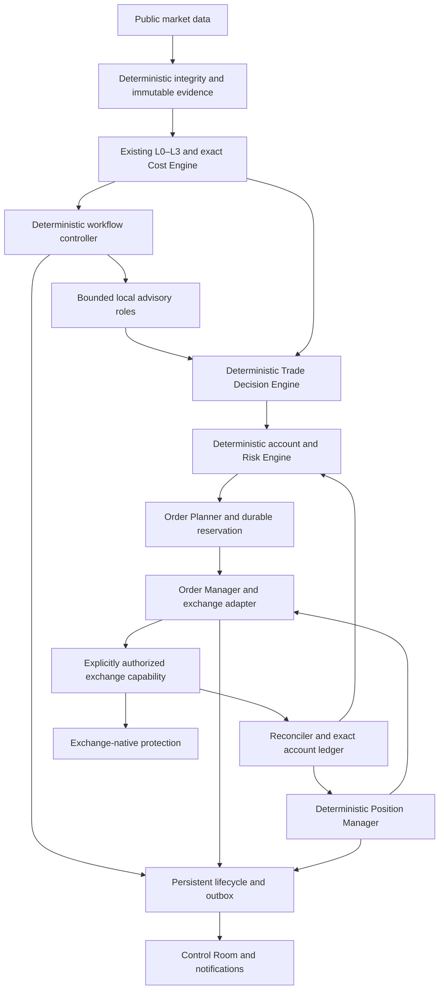

# Future execution architecture — EX-1

Status: **ACCEPTED DESIGN ONLY. No private integration, live execution, account access or financial order is implemented or authorized by this document.** Current crypto-radar remains a public-data analysis application, with documented legacy cloud/runtime defects. F0–F7 is a separately gated future program. This document closes the design; capability evidence, empirical strategy qualification and explicit capital permissions cannot be manufactured by architecture.

Authority: RISK.md defines the current prohibition; this EX-1 defines the future boundaries; OPERATING_CONTRACTS (OC-1) owns analysis/model/measurement policy; FUTURE_TRADING_ROADMAP owns promotion. FAILURE_AND_QUALITY owns engineering and failure standards. If an execution-specific freshness or protection requirement is stricter than an analysis requirement, the stricter execution requirement applies to orders. Changes require a versioned decision, compatibility plan and new validation, not an ad-hoc exception.

## 1. Components, process boundaries and pipeline

Current: public Kraken observations → L0/L1/L2/L3 → local Qwen analysis/routing and legacy event paths → event/history → notification → human decision. There is no implemented general Trade Decision Engine, portfolio Risk Engine, Order Manager or autonomous Position Manager. Existing LLM risk-like output fields are advisory legacy debt, not financial permission. Existing public futures analysis does not establish derivatives execution capability.

Accepted future path:

One local Windows trading service owns an account's bot order/position state. A fenced single-writer lease and transactional reservations prevent two local owners. Desktop UI, inference worker and collector are separate clients/processes. The service starts in RECOVERY_LOCKED, reconciles before admitting entries, and does not require the UI or models for protection. UI closing must not terminate it. OS service restart is supervised, but restart is not a substitute for exchange-native protection during local power/network failure. Only the execution service composition root can bind order-capable ports, and only in an approved live mode. No model, notification worker or UI bridge can obtain that port.

Initial live product is cash-funded spot LONG, no margin or borrowing. There is one independently approved strategy profile and one bot-controlled inventory allocation; F5 permits one simultaneous position. No autonomous transfer, leverage change or financial scope expansion. Futures/SHORT observations may be analyzed/paper-tested, but cannot become live orders until F7's separate proof and approval progression.

## 2. Domain records and provenance

Use strict immutable typed records, Decimal money/quantity with explicit currency/instrument units, UTC timestamps and injected clocks. JSON money is a canonical decimal string. Reject booleans, floats, NaN/infinity, negative sizes, unsupported precision and unknown enum fields at financial boundaries. Statistical indicators remain floats with validated finite values. Instrument identity includes venue, market type, native symbol, base, quote and contract/settlement metadata; an asset ticker is not an order identity.

| Record | Required content and ownership |
|---|---|
| EvidenceManifest | Run/opportunity/version, instrument, source/receipt/as-of times, integrity verdict, immutable evidence IDs, feature versions, sealed hash; collector/controller owns |
| AgentAssessment | Role/model/prompt/profile version, evidence version, advisory enum, factual claims with evidence IDs, inferences, objections and explicit unknowns; no executable numbers/actions |
| StrategyProfile | Deterministic setup/direction/action rule, horizon, feature versions, registered outcome/cost cohort, calibration/edge evidence, stop/time-exit policy, approved instruments and mode; owned by the versioned strategy registry |
| TradeDecision | Decision ID, evidence/profile hashes, candidate direction, TRADE_LONG/TRADE_SHORT/NO_TRADE/WAIT/ABSTAIN, reason codes, disagreement record, expiry; deterministic decision engine owns |
| AccountSnapshot | Account identity, received/as-of time, reconciliation generation, balances/available cash, liabilities, bot/unowned inventory, open orders, fills, fees, pending reservations and unknowns; reconciler owns |
| RiskVerdict | Permission ID, proposed quantity ceiling, worst-case reserved cash/loss, account/evidence/profile versions, limits and reason codes, expiry; Risk Engine owns |
| OrderIntent | Stable intent ID, parent decision/permission, client order ID, instrument/side/type/quantity/limit/TIF/deadline, cost scenario, protection plan, capability/approval versions, idempotency hash; Order Planner owns |
| OrderRecord | Venue order ID(s), client ID, intent ID, submission/ack/state versions, cumulative fills/fees, pending/unknown status, last reconciliation, error evidence; Order Manager owns |
| PositionRecord | Bot-owned filled inventory and cost basis, fees, protected quantity/order IDs, remaining quantity, thesis/profile, stops/time exit, realized/unrealized results, reconciliation generation; Position Manager/ledger owns |
| ApprovalRecord | Account/strategy/instrument/mode, code/policy/model/capability digests, maximum cash/loss/exposure, effective/expiry time and explicit user approval reference; immutable authorization store owns |

Decision, risk permission and order IDs are distinct. Each state change carries causation/correlation IDs, monotonic local revision and UTC event time. Communication events describe actual dispatch/acceptance, not arrows inferred from this architecture. Protected order details are operational facts; models may receive a redacted factual summary when specifically useful, never credentials or order authority.

## 3. Six dimensions, never one confidence number

1. **Agent self-confidence:** uncalibrated expression retained for diagnosis, excluded from sizing and trading thresholds.
2. **Empirical probability:** held-out calibrated probability of a precisely defined outcome, with model/cohort/sample metadata; unavailable means UNCALIBRATED.
3. **Evidence quality:** deterministic completeness, identity and integrity/freshness verdicts; one failed required input cannot be averaged away.
4. **Opportunity ranking:** deterministic relative score used for analysis admission, not a probability or financial permission.
5. **Execution admissibility:** current cost, liquidity, fee, quantity, protection and venue capability verdict for this actual proposed order.
6. **Risk permission:** account-aware deterministic quantity and loss/exposure limits after reservations and unknown orders.

Store and display them separately. “High confidence” never overrides any negative or unknown execution/risk verdict. A model cannot set entry quantity, account risk, maximum leverage, stop distance or allowed loss. It may identify a claimed market invalidation level as evidence; a deterministic strategy policy must independently validate and transform it, or reject it. EX-1's initial policy does not use model-supplied levels.

## 4. Deterministic Trade Decision Engine

The TDE is a pure replayable function of a registered StrategyProfile, qualified evidence, selected valid role assessments, precomputed cost/edge/calibration records and current position context. It returns an advisory decision; Risk Engine and Order Manager remain separate gates. It does not ask an LLM to write the final executable plan.

Apply this precedence exactly:

1. Expired/invalid evidence or missing profile → ABSTAIN with hard reason, no further calls to rescue the same version. Unsupported market/direction or disabled strategy → NO_TRADE.
2. Required cost, edge, calibrated probability or required valid role output unavailable → ABSTAIN. Missing optional role that is not part of the qualified path does not veto the simpler qualified path.
3. Deterministic hard veto, qualified critical Challenger objection, model request for forbidden authority, or invalid evidence citation → NO_TRADE for this candidate and record the defect/objection. Validation failure may invoke only OC-1's one shared repair if budget permits; no repair can change a real hard veto.
4. All role outputs must match the immutable candidate's instrument/direction and evidence version. Opposing direction, incompatible factual claims, or an unresolved material objection → ABSTAIN/DISAGREEMENT. Do not majority vote, average self-confidence, reverse direction or request unlimited debate.
5. A remediable missing current input may return WAIT once, only if the deterministic controller has a declared refresh path and the original deadline permits it. OC-1 permits at most one regenerated evidence version with its cooldown; WAIT never extends or resurrects the original opportunity.
6. Only when the registered deterministic setup/action rule, mandatory qualified roles and empirical edge criteria pass can TDE emit TRADE_LONG/TRADE_SHORT. In current/future initial spot live modes TRADE_SHORT is rejected downstream as unsupported. TRADE_LONG still is not an order or risk permission.

Challenger objections are CRITICAL (required fact/capability/safety contradiction), MATERIAL (plausible thesis-invalidating evidence) or ADVISORY. The model proposes a category; deterministic validation checks cited evidence and maps registered objection types. Unknown/unregistered serious objection fails conservatively to ABSTAIN, never becomes an execution instruction. Deterministic checks own spread/cost/depth/volatility/funding/freshness; the model cannot recalculate a failed check into a pass. Advisory objections remain in the explanation but do not veto unless the frozen strategy profile says so.

Direction and action thresholds are fixed in the registered strategy profile before evaluation. A new direction rule, asset class or agent response interpretation is a new profile/experiment. No averaging of profitable and unprofitable unregistered subgroups. OC-1 fixes probability and net-edge qualification; insufficient data means no qualified trading strategy. TDE is idempotent for the same input hashes and policy version.

## 5. Account ownership, ledger and Risk Engine

Account state comes from authorized adapter observations reconciled against durable bot records, not model memory. A spot inventory position is internally derived from bot-attributed fills; do not confuse exchange balances with isolated bot positions. Prefer a dedicated user-approved account allocation. If the account is shared, manual/external orders and holdings are quarantined; no automatic adoption, selling or canceling them. Unknown balances/liabilities/reservations block new entries. Authorization must identify the owned allocation and how shared-account interference is detected.

Ledger has exact cash, inventory, fee and realized-PnL postings per unique venue execution ID. Corrections are compensating records, not overwrites. Every fill is booked once locally; out-of-order receipts are allowed but cannot regress cumulative filled quantity. A venue cumulative fill contradicting the ledger triggers reconciliation lock. Entry reservations remain until authoritative terminal reconciliation accounts for every possible fill and fee. Open/ambiguous orders count toward risk. Cash reservations include entry consideration, fee currency conversion and bounded execution-cost allowance; base-currency fees reduce sellable/protectable inventory.

Risk permission is evaluated and reserved atomically under the account generation. Recheck generation before committing an intent; a stale permission cannot spend a newer balance. Live order admission requires book receipt/source age ≤2s where source time exists, reconciled account receipt age ≤2s, effective clock offset/uncertainty ≤500ms, verified current exchange/instrument state and no unresolved order ambiguity. Receipt-only feeds must be explicitly capability-qualified; source freshness is never fabricated. OrderIntent age ≤5s and no later than evidence/approval/permission deadlines. Failing refresh within these bounds means no entry, not a larger freshness limit.

The following are **EX-1 synthetic PAPER policy defaults and hard ceilings for any initial proposed live envelope**, not permission or personal capital recommendations. A real envelope must explicitly approve absolute quote-currency loss/cash limits and may be stricter. Unknown/unapproved absolute values disable live.

| Limit | EX-1 ceiling / deterministic response |
|---|---|
| Per-entry planned stress loss | ≤0.25% of assigned equity, including both-leg fees, bounded stress exit slippage and stop distance; lower explicit absolute cap also applies |
| Aggregate open + pending planned stress loss | ≤0.50% of assigned equity; unresolved submissions retain full reservation |
| Gross allocated position + pending notional | ≤10% of assigned equity; F5 one simultaneous position; min-order incompatibility means NO_TRADE, never round up |
| Free-cash buffer | At least 10% of assigned equity remains unreserved after entry and fee allowances |
| Daily loss lock | Realized + conservative marked unrealized PnL including fees ≤−1% of UTC-day-start assigned equity locks new entries; external deposits cannot reset loss accounting |
| Drawdown lock | ≥3% below assigned-equity high-water mark locks new entries; no automatic high-water reset |
| Correlated exposure | Until a qualified correlation model exists, all crypto positions belong to one fully correlated bucket subject to the aggregate loss/notional limits |
| Simultaneous instrument intents | One active entry intent per strategy/instrument/direction episode; opposite/duplicate entries rejected |
| Borrowing/leverage | Zero borrowing, cash spot only; no ability to increase leverage |

A loss lock is persisted and requires reviewed cause plus the roadmap's requalification/approval rules before new entries; midnight, app restart or a new prompt cannot clear it. These limits bound planned exposure, not maximum realized loss through a gap, exchange failure or adverse fill. Stress scenarios are conservative engineering inputs with provenance, not guarantees.

Initial paper policy: deterministic long stop distance is 2 × validated closed 5m ATR14 from the evidence version; initial take-profit proposal is 2R, maximum hold is the registered strategy horizon. No model sets or widens these values. The strategy must separately qualify this exact exit policy under realistic costs; otherwise it remains only a simulator fixture. Initial EX-1 has no trailing stop, pyramiding, averaging down, automatic reversal or discretionary model exits. A future feature needs a versioned strategy and experiment, not a developer choice.

Sizing uses the minimum of quantity supported by per-entry loss, remaining aggregate loss, notional and cash ceilings; round DOWN to venue lot size; check minimum notional/quantity and fees after rounding. Worst-case modeled per-unit loss includes entry-to-stop distance plus both-leg costs and stress exit gap/slippage. If any input is missing, denominator nonpositive, tick rounding invalidates the stop, or minimum quantity exceeds the cap → NO_TRADE. Re-run cost and risk on the final rounded quantity. Reject if iterative quantity/cost consistency fails within three deterministic downward-only passes; do not loop until a trade fits. Risk reduction exits can proceed after entry locks only against verified owned quantity and a safe protected exit protocol; they cannot add exposure.

## 6. Cost Engine and order choice

CostEngine is deterministic and side/size/venue/time-specific. Output itemizes entry/exit fees, spread/book impact convention, modeled slippage/adverse selection, FX and applicable funding/borrow costs, uncertainty bounds and source/validity. A missing item is UNKNOWN, never zero. Spot has explicit not-applicable funding/borrow values; that is different from missing futures data. Depth-weighted execution relative to mid already includes half-spread; do not add it twice. Both legs and fee currency matter. Forward markout against a hypothetical cost scenario is not an observed executed return.

Planner supports only approved deterministic plans. For initial PAPER and candidate live entry:

- **Maker:** post-only limit buy at validated best bid, never crossing. Proposed quantity/price are tick/lot valid. Maximum dwell 10s, one initial submit and no price-chasing amendment; cancel residual afterward, reconcile terminal state, preserve/protect partial fills. Maker fees and non-fill/adverse-selection distribution must have qualified evidence. A touched price is not assumed filled in the simulator.
- **Taker:** bounded marketable IOC limit order with price ceiling derived from validated current book and the registered maximum entry slippage. EX-1 proposed ceiling is 10 bps above decision mid and no worse than the exact risk/cost cap; insufficient depth at that bound means NO_TRADE. Unsupported IOC/limit/protection combination fails capability gating. Do not silently use an uncapped market entry.
- **Selection:** compare conservative expected net utility including maker fill probability/non-fill and opportunity delay against taker cost on the same qualified policy. Maker fill probability is UNCALIBRATED until held-out paper/shadow evidence qualifies it; then maker is unavailable. If both are qualified and satisfy edge/risk gates, choose higher conservative net utility; tie prefers lower worst-case cost, then maker. If neither is admissible → NO_TRADE. Choice is recorded, not delegated to a model.

No automatic maker-to-taker conversion in EX-1. A later fresh opportunity may be independently evaluated only after the prior order/partial position is reconciled and all episode/cooldown/exposure rules permit it. Fees eliminating edge produce NO_TRADE regardless of agent agreement. Fee tier is account-specific verified evidence before live, never inferred from a public headline fee. Current market rules/minimums/tick sizes/status and account eligibility are separately verified capabilities.

## 7. Durable order lifecycle, idempotency and reconciliation

States: PLANNED → RESERVED → READY → SUBMITTING → ACKNOWLEDGED/OPEN → PARTIALLY_FILLED → FILLED or CANCEL_PENDING → CANCELED. Explicit alternatives are REJECTED, EXPIRED, SUBMISSION_UNKNOWN, RECONCILING and INCIDENT_LOCKED. A state transition does not assert a fill without authoritative evidence. CANCEL_PENDING may receive more fills. Terminal local state requires accounted cumulative fills and reconciled residual; a transport timeout is never REJECTED.

Atomic local transaction writes reservation, immutable intent, unique client order ID and submission outbox before network. The dispatch worker claims a fenced record and marks SUBMITTING durably before calling the adapter. If process/network fails before an authoritative outcome, recovery treats it as potentially submitted even if local code suspects the socket was never sent. Retain reservation; look up by client/venue IDs and reconcile open orders, recent/older execution history and balances using adapter capability-specific coverage. Never resend the same entry simply because a timeout elapsed or one query found nothing.

Use an application-wide permanent unique client order ID and local uniqueness constraints for the intent's lifetime. Kraken's documented `cl_ord_id` uniqueness is for **open orders**, so it is not lifetime exchange idempotency. A closed-and-resubmitted ID cannot be assumed harmless. Unknown resolution requires a venue-supported authoritative negative proof or manual incident resolution with complete account evidence. EX-1 defaults to indefinite entry lock and retained reservation when absence cannot be proven; no timeout authorizes a retry. Operator resolution is audited and cannot guess away possible fills.

On restart: acquire process/account fence → integrity-check DB/migrations → load unresolved intents/reservations/protections → connect and reconcile full required account history since last durable checkpoint with overlap → deduplicate execution IDs → verify owned inventory/protection → publish coherent account generation → enter READY only if all gates pass. Stale owner cannot commit or publish. Old binary may read compatible history or refuse startup; it cannot run against an incompatible schema.

WebSocket provides timely facts, REST/backfill provides reconciliation coverage. A subscription sequence detects that stream's discontinuity; do not treat it as a universal exchange ledger. On gap/disconnect lock new entries, retain orders/protection, reconnect with snapshot plus overlapped history, verify no missed fills and only then unlock. Periodic full reconciliation every 30s even with a healthy stream; immediate reconcile for any contradictory event, ambiguous submit/cancel or protection change. The ≤2s admission account generation may require an additional supported lightweight refresh; if the adapter cannot meet it within legitimate rate limits, no new entry is admitted. No flood of private queries to satisfy a freshness target.

Backoff transport reads with bounded jitter/retry inside adapter limits. Order submissions are never ordinary HTTP auto-retry middleware. Invalid nonce/time/signature/auth errors lock capability; do not print secrets. Instrument/side/quantity mismatch quarantines the event/account, never fixes an order by guessing symbol aliases. Reconciliation preserves manual/unowned activity separately.

## 8. Position Manager and protection independent of AI

PositionManager is deterministic and wakes on fill/account/protection changes plus a one-second service timer. Timer availability is not a safety promise: exchange-native protection must already cover every filled quantity even while the service, OS, UI and inference are unavailable. A model may publish a later thesis explanation, but cannot remove a stop, increase inventory, widen loss, alter risk permissions or block risk reduction.

Live entry is permitted only with a verified **atomic venue-side entry/protection arrangement** whose partial-fill behavior protects the actual net sellable filled quantity, including base fees and rounding. Entry-plus-later-local-stop is not acceptable for EX-1 live. A documented conditional order concept alone is insufficient: correct spot product/order combination, activation timing, fee handling, rejection behavior and partial fills must be proven in F4. No proof → no live entry. Protection cannot guarantee a fill price or survive exchange-wide failure; those are residual risks recorded in approval.

At every reconciliation compare bot-owned open quantity with confirmed protective residual quantity and linkage. Overprotection can be as dangerous as underprotection. Do not assume spot reduce-only exists. Protective and profit orders must not compete for balance or oversell; use only proven native contingency/OCO semantics or a certified equivalent protocol. EX-1 disables simultaneous independent take-profit orders when no safe linked mechanism is proven. Time exit or thesis-invalidated exit likewise requires a capability-certified transition preserving protection through cancel/fill races. Do not cancel the only stop and then attempt a market sell as a generic workaround.

A protective native stop-market is preferred for downside trigger behavior when the venue/product/contingency supports it, accepting gap/slippage risk; stop-limit can fail to exit and is not an equivalent guarantee. The actual permitted stop type is fixed by the capability dossier and risk approval. Initial protection reference and rounding must be validated before entry; fills at a different price cause deterministic accounting/risk re-evaluation but never automatic stop widening. Filled size exceeding plan, missing/rejected stop or unexpected unprotected inventory is an immediate incident.

**Protection incident protocol:** freeze new entries; preserve all verified protective orders; cancel only verified unfilled entry residual through reconciled order IDs; determine net owned inventory and existing protective orders. If an already-certified emergency exit protocol can reduce that quantity without competing protective sells/oversell, invoke it within its deterministic cap. Otherwise enter INCIDENT_LOCKED, issue a high-priority human alert and continue reconciliation. Do not invent a supposedly safe emergency order in unknown state. Live approval must acknowledge this residual inability to guarantee liquidation under uncertain exchange state.

Any protective-order modification uses a proven atomic amend/replace preserving coverage, or is refused. No trailing protection is enabled initially. A future trailing policy may tighten only, never widen, and requires separate evaluation and capability proof. On strategy/model/drift disablement, existing protection continues; no automatic liquidation merely because an LLM fails. Daily loss/drawdown lock cancels new unfilled entries, keeps protected positions and follows their already-approved deterministic exit plan. Human emergency flatten is a distinct authenticated action through the same safe protocol, not a model command.

A blanket “cancel all orders” kill switch is forbidden because it may remove stops. Kraken's cancel-all-after/dead-man facility cancels all affected account orders on expiry; EX-1 does **not** enable it on the protected trading account. A future change needs a demonstrated protection-preserving scope, new decision and tests. No service/watchdog credential should acquire transfer permission.

## 9. Memory, observability and recovery evidence

Facts persist in the ledger/evidence store; no agent chat is the account system of record. Agent context obeys OC-1 as-of retrieval/token budgets and independence. Position advice, if later measured useful, receives current redacted position/evidence summary in a fresh call, never becomes a perpetual controlling conversation. It is disabled initially. Default mandatory roles are deterministic services; adding an LLM must prove incremental measured value.

Observe decision reasons, model/schema/citation failures, deadlines/ABORT_STALE, cost completeness, queue/load, account age, reconciliation lag, open/unknown orders, protection coverage, reservations, risk locks and outbox lag. Alerts distinguish degraded analysis from exposure/protection incidents. UI states reflect persisted facts; orders/protection are operational statuses, not fictional agent communication. UI cannot suppress a service risk lock by clearing a notification.

Audit retains input/output hashes and exact policy/capability versions, not secrets. Factual histories and future account/order records follow OC-1 retention, with explicit privacy review before private activation. Disk/DB failure locks new entries; native protection remains. Backups are consistent SQLite backups including required WAL state, encrypted/access-controlled when private data exists, restored only in a disconnected drill before connecting to an account. A restored snapshot must reconcile live venue state before becoming writable/READY; replaying old order intents as new submissions is forbidden.

## 10. Capability proof and authorization

Capability dossier is versioned per venue/product/account/order combination, with official source/date, observed proof, limits, unknowns and expiry/recheck conditions. Recheck on API/client/account/product-rule change and before approval renewal. Required capabilities: eligible instrument/spot permissions, current precision/minimums/fees, client-ID lookup/coverage, execution history pagination, partial fills and cancel races, exact protected net quantity, native contingent stop activation/rejection, safe exit/amend behavior, rate limits, clock/deadline behavior and account ownership. UNKNOWN always disables the relevant live action.

Official references inspected for this design:

- [Kraken Spot WebSocket v2 add order](https://docs.kraken.com/exchange/api-reference/spot-websocket-v2/add_order): post-only behavior, conditional secondary orders on primary fills, client IDs, order deadline and product-specific parameters. Documented deadline range is 500ms–60s, default 5s; this does not replace the application's freshness/expiry gates. Margin-oriented reduce-only wording is not proof of cash-spot protection.
- [Kraken executions stream](https://docs.kraken.com/exchange/api-reference/spot-websocket-v2/executions): account execution/order updates and bounded snapshot options. A recent-trade snapshot is not complete historical reconciliation.
- [Kraken cancel all orders after](https://docs.kraken.com/api-reference/trading/cancel-all-orders-after-x): a broad cancellation mechanism, not inherently protection-safe.

These sources inform interfaces; no private venue behavior was tested during this audit. Sandbox/test environments may not faithfully prove mainnet behavior. If a critical property cannot be established without real orders, F4 documents the gap; only an explicitly scoped minimum-risk capability canary approval could test it, and unsupported safe canary design means BLOCKED. Do not falsely mark a paper test as proof. No order is authorized by this paragraph.

Modes and durations are fixed in FUTURE_TRADING_ROADMAP: PAPER → specifically authorized private-read SHADOW_LIVE → separately approved MICRO_LIVE → explicitly constrained/approved envelope. Approval hashes bind code, policy, capability, strategy/model profile and limits. Expiry/material change immediately prevents new entries; protection/reconciliation continues. Failed gates revert new-entry mode to the last safe stage and preserve audit/history. No automatic promotion based on PnL, elapsed time, available credentials, user inactivity or completion of the analysis roadmap.

## 11. Acceptance contract and rejected shortcuts

F0/F1 test replay, exact money, all veto/unknown/disagreement branches and concurrent reservation limits. F2 executes ≥10,000 seeded order/position sequences and every durable/network crash boundary, duplicate/out-of-order events, partial fills, cancel/fill races, missing protection, fee currency/rounding, expired permissions, stale account, disk failure and UI/AI outage. No entry/adoption/duplicate retry is permitted from an unknown state. Positive behavior tests must prove allowed safe paths remain usable, not only assert that everything is rejected.

F3/F4 add account-history/adapter/capability proof and independent review; ordinary unit tests never call private APIs. F5/F6 require the exact time/sample/safety/edge/approval gates in the roadmap. Tests cannot establish profitability or eliminate venue risk. No general Risk Engine was imported from Sextant; adapt exact money, ledger/cost/provenance/ports and test patterns only through scoped tasks.

Rejected: pure LLM final executor, confidence-weighted sizing, majority-vote permission, infinite agent debate, blind submission retry, exchange client ID as lifetime exactly-once, stale balance admission, manually derived spot reduce-only assumptions, entry then local stop, stop cancellation before an unproven close, broad dead-man cancellation, automatic manual-position adoption, cloud fallback, live scope expansion from public futures support, and wholesale Sextant migration.

All mandatory architecture has an owner, contract, failure state and delivery phase. Remaining work is implementation plus specified empirical/capability/authorization evidence. A missing proof keeps the capability disabled; it is not an invitation for a developer to improvise financial behavior.
